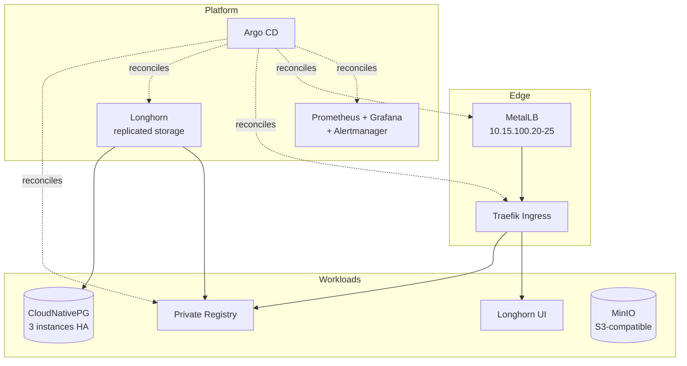

# Homelab — Bare-Metal Kubernetes Platform

A self-hosted Kubernetes cluster built from scratch on bare metal, used to run and operate
the same building blocks found in production: GitOps delivery, distributed storage, a
load-balanced ingress edge, highly available PostgreSQL, S3-compatible object storage, a
private container registry, and a full metrics and alerting stack.

This repository holds the manifests and the operational notes behind it.

---

## Cluster

| | |
|---|---|
| **Nodes** | `master` (control-plane) + `worker01` |
| **OS** | Ubuntu 24.04.4 LTS, kernel 6.8 |
| **Kubernetes** | v1.36.2, bootstrapped with `kubeadm` |
| **Runtime** | containerd 2.2.1 |
| **Network** | `10.15.100.0/24` |

## Platform stack

| Component | Role | Deployed via |
|---|---|---|
| **Cilium** | CNI — eBPF pod networking, Envoy data plane | kubeadm bootstrap |
| **MetalLB** | Bare-metal `LoadBalancer` services, L2 pool `10.15.100.20-25` | Argo CD |
| **Traefik** | Ingress controller, exposed on `10.15.100.20` | Argo CD |
| **Longhorn** | Distributed replicated block storage, default `StorageClass` | Argo CD |
| **MinIO** | S3-compatible object storage, 50Gi on a static local PV | manifests |
| **CloudNativePG** | PostgreSQL operator — 3-instance HA cluster with automated failover | manifests |
| **Registry** | Private container registry, 10Gi Longhorn volume | Argo CD (this repo) |
| **kube-prometheus-stack** | Prometheus, Alertmanager, Grafana, node-exporter, kube-state-metrics | Argo CD |
| **Argo CD** | GitOps controller reconciling the applications above | manifests |



## Internal endpoints

Resolved through private DNS — reachable on the LAN or over VPN only.

| Host | Service |
|---|---|
| `rgstibursio.local` | Private container registry |
| `horntibursio.local` | Longhorn UI |

## Repository layout

```
kubernetes/
├── argocd/          Argo CD Application definitions (longhorn, metallb, traefik, registry)
├── cloudnativepg/   PostgreSQL operator install notes and a 3-instance HA cluster
└── registry/        Private registry — Deployment, Service, PVC and Traefik IngressRoute
```

## Notes

* Argo CD reconciles the platform components. Only the **registry** is sourced from this
  repository; Longhorn, MetalLB, Traefik and Prometheus track their upstream Helm charts.
* The Argo CD `Application` manifests under `kubernetes/argocd/` were created through the
  UI and exported here, so they are a snapshot rather than the live source of truth.
* MinIO runs on a static `local-disk` PV rather than Longhorn, to keep object storage off
  the replicated layer.

### Known issues

* `local-disk` and `longhorn` are **both** marked as the default `StorageClass`. Kubernetes
  does not define which one wins, so a PVC without an explicit `storageClassName` can bind
  unpredictably. `local-disk` should lose the default annotation.
* The Prometheus Argo CD application reports `OutOfSync`.
* The monitoring stack sits in the `default` namespace and belongs in a dedicated one.
